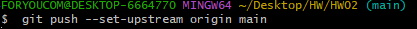

# 프로그래밍 패턴 2주차 GIT에 대한 조사

## 1.VCS란 무엇인가? 
 vcs란 Version Control System(버전 관리 시스템)으로 형성 관리 지침을 활용하여 다양한 버전의 소프트웨어나 콘텐츠의 개발, 변경, 개선과 관련된 수정사항을 관리하고 추적하는 도구로 동일한 소스코드에 대한 여려 버전을 관리하는 것을 말합니다. 즉 파일 변경 사항을 시간에 따라 기록하며 필요할 때 특정 버전을 다시 호출할 수 있는 시스템입니다. 버전 관리의 종류로는 로컬, 중앙집중식, 분산이 있으며 git은 이 중에 분산vcs(DVCS)에 속합니다.

## 2.DVCS와 VCS의 차이점
 우선 DVCS란 로컬 저장소(참여자의 각 컴퓨터)에 프로젝트파일을 1차적으로 저장하고 사용자의 명령에 따라 원격 저장소(서버저장소)에도 저장이 가능합니다. 
 - 네트워크 의존성 
    * VCS는 중앙서버에 의존하여야 하기 때문에 네트워크 연결이 필수입니다.
    * DVCS는 로컬 저장소에 전체 저장소에 사본을 가지고 있어 네트워크 연결이 없더라도 작업이 가능합니다.
 - 분산의 유연성
    * VCS는 중앙 서버에서 파일을 저장하고 가져와야 하기 때문에 중앙 서버에 문제가 발생하면 작업에 영향이 갈 수 있읍니다
    * DVCS는 각 개발자가 로컬에서 작업하고 있어 변경사항을 다른 개발자와 공유하기 때문에 중앙 서버의 문제가 전체 작업에 직접적으로 영향을 미치지 않습니다.
 - 협업과 분산 개발
    * VCS의 경우 네트워크 문제, 병합지연(중앙서버에서만 파일을 업데이트 할 수 있어서 여러 개발자가 동시에 파일을 수정하고 중앙 서버에 푸시하려하면 충돌이 발생할 수 있습니다.), 중앙 서버의 관리(중앙 서버에서 모든 변경 사항을 관리하고 이력을 유지해야 하므로 관리자의 실수나 잘못된 구성으로 충돌이 발생할 수 있습니다.)로 인하여 서버에서의 충돌이 자주 발생할 수 있습니다.
    * DVCS는 여러 사용자가 동시에 작업하며 변경 사항을 쉽게 병합할 수 있도록 지원합니다

이러한 VCS의 문제점으로 인하여 현재는 DVCS가 대부분의 프로젝트에서 선호되는 방식으로 git같은 DVCS가방식이많은 프로젝트에서 널리 사용되고 있습니다.

## 3. GIT을 이용하여 remote repository를 생성하고 git용 bash로 새로 initialize한 local repository랑 연결하는 과정을 스크린샷과 함께 각 명령어의 자세한 설명을 작성하시오. (이때 브랜치명은 main으로 합니다.)
  
1. 처음 시작하는 위치 '~' 는 사용자폴더라는 뜻이기 때문에 cd명령어를 사용하여 폴더를 HW02폴더까지 이동시킵니다.이동 시키는 중에 HW02폴더가 없기 때문에 mkdir 폴더명을 사용하여 폴더를 생성합니다.

  
2. cd를 사용하여 HW02폴더로 지정 되었다면 git init을 사용하여 git을 초기화하여 새로운 로컬 저장소를 만들어 줍니다. (이때 정상적으로 깃이 초기화되어 새로운 로컬 저장소가 생겼다면 초기화했던 폴더의 .git이라는 숨겨진 폴더가 생깁니다.)

  
3. git branch -m 현재이름 바꿀이름 을 사용하여 브랜치명을 master에서 main으로 변경해줍니다.

  
4. git congig --global user.name/email을사용하여 깃허브 닉네임과 이메일을 등록합니다. (등록과정은 한 컴퓨터에서 1회만 하면 됩니다.) 이 설정은 커밋을 할 때 커밋 기록에 사용됩니다.

  
5. vim 파일명을 사용하여 vim편집기를 실행하여 파일을 생성 또는 편집합니다.

  
6. git remote add origin 원격 저장소URL 을사용하여 git에서 로컬 저장소를 원격 저장소에 추가하는 명령입니다. (origin은 관례적으로 보통 원격 저장소의 기본 이름으로 사용됩니다.)

  
7. git add . 은 git에서 변경된 모든 파일을 스테이징 영역에 추가하는 명령입니다. 여기서 '.'은 현재 디렉토리를 나타내며 변경된 모든 파일을 의미합니다. (git add 파일/디렉토리 경로 로 전체가 아닌 하나만 지정하여 사용할 수 있습니다.)

  
8. git commit -m "텍스트"는 커밋 메세지를 지정하는 명령입니다. 해당 커밋에 대한 간단한 설명이며, 다른 사용자들이 커밋 내용을 파악하기 쉽게 도와줍니다.(커밋 메세지는 작업한 내용이나, 변경 사항을 간결하게 요약하여 작성합니다.)

  
9. git push --set-upstream origin main은 로컬 저장소의 현재 브랜치를 원격 저장소의 브랜치와 연결하고 푸시하는 명령입니다. 
 * git push는 로컬 저장소의 변경사항을 원격 저장소로 전송하는 명령입니다.
 * --set-upstream origin main 에서 --set-upstream, 또는 -u는 현재 로컬 브랜치를 원격 브랜치와 연결하고 트래킹하는 역할을 합니다 (origin 원격저장소, main 원격저장소에 푸시할 브랜치 이름) 
이후에는 단순히 git push 명령만으로도 변경사항을 푸시할수 있습니다.

## 4.gitignore 사용법과 작성방식 및 내용에 대해서 조사를 해 오시오.

 * gitigonre : gitigonre파일은 Git에서 추적하지 않을 파일이나 디렉토리를 지정하는 데 사용됩니다. 이 파일을 사용하여 Git으로 관리되지 않아야 하는 로그, 빌드, 개인설정파일 등을 지정할 수 있습니다. gitigonre파일은 표준 Gold패턴을 사용합니다. 표준 Gold패턴이란 정규표현식을 단순화한 것입니다.(정규표현식은 많은 프로그래밍언어와 텍스트편집기에서 지원하며, 복잡한 패턴을 간단하게 표현할 수 있습니다.)
 * 사용법
    - vim .gitignore를 사용하여 파일을 생성하고 편집기를 열어 줍니다. 
    - 파일에 무시할 내용들을 추가합니다. 
    - 작성된 파일은 Git이 해당 파일이나 디렉토리를 무시하도록 지시합니다.
    - gitignore 파일은 프로젝트 디렉토리 최상단에 위치해 두어야 합니다.
    - gitignore 파일은 모든 개발자와 공유해야 하며 동일한 무시 규칙을 따를 수 있도록 해야 합니다.  

 * 작성법
    - #은 주석을 의미하며, 빈라인은 아무런 영향을 주지 않습니다.
    - /파일명.확장명 : 파일 제외 
    - /파일명.확장명 : 현재 경로에 있는 파일만 제외(다른 경로의 동일한 파일명은 추적합니다.)
    - 폴더명/파일명.확장자 : 특정 경로안의 특정 파일 제외
    - 폴더명/ : 특정 폴더안의 파일 전부 제외
    - '*' .확장자 : 해당 확장자 파일 전체 제외
    - !제외할 파일명 .확장자 : 예외처리(무시되지 않고github에 커밋됩니다.)


## 5.ReadMe.md 파일에 사용된 Mark Down 표기법에 대해서 헤더/목록(숫자)/순서없는목록(ex> * )/들여쓰기/코드블럭/수평선/링크/이미지/강조 에 대한 사용방법을  정리해 오시오.

* 헤더: 제목을 나타내는데 사용됩니다. (#, ##, ###, ....)
# #제목 1 (가장 큰)
## ##제목 2 
### ###제목 3 
#### ####제목 4
##### #####제목 5
###### ######제목 6 (가장 작은)

* 목록(숫자) : 순서가 있는 목록을 작성하는데 사용됩니다. (1. 2. 3. ......)
1. 첫번째 항목
2. 두번째 항목
3. 세번째 항목

* 순서가 없는 목록: 순서가 없는 목록을 작성하는데 사용됩니다.
 - 첫번째 항목(-)
 - 두번째 항목(-)  
 * 첫번째 항목(*)
 * 두번째 항목(*)
 + 첫번째 항목(+)
 + 두번째 항목(+)

* 들여쓰기 :순서가 있는/없는 목록을 사용중에 공백을 만들어줍니다.(Tab, Enter)
  
- 순서 없는 항목입니다. - 다음에 띄어쓰기를 하고 내용을 적습니다.
- 엔터를 쳐서 아래로 내려가면 자동으로 - 가 생깁니다.
    - 들여쓰기도 가능합니다. 
        - 여러번 들여쓰기도 가능합니다

1. 순서가 있는 항목입니다.
2. 숫자를 쓰고 .을 찍고 띄어쓰기를 한 다음에 내용을 적습니다. 
    1. 마찬가지로 들여쓰기가 가능합니다.
        - 순서가 있는 항목과 순서가 없는 항목을 혼용해서 사용할 수 있습니다. 

* 코드 블럭: 코드를 일반적으로 표시하고 싶을 때 사용합니다. 코드의 언어를 지정하지 않으면 일반 텍스트로 취급됩니다. 코드블럭을 시작할 때 백쿼드세 개(```)를 입력하고 해당 코드의 언어를 지정합니다. 그 다음 줄에 코드를 작성하고 코드 블럭을 마무리하기 위해 다시 백쿼트 세 개를 입력합니다.  

```python
def greet();
    pringt("Hello, World")
```  

```
print("Hello, World")
```  

* 수평선: 문서를 분리하거나 섹션을 나눌 수 있습니다. 이는 문서의 구조를 명확하게 만들고 가독성을 향상시키는 데 도움이 됩니다. (-, *, _ 3개이상 연속하여 사용하면 수평선이 생성됩니다.)
---
***
___

* 링크 : 링크를 추가하면 문서에서 다른 웹페이지로 연결이 가능해집니다.
   - 인라인 링크[Google](https://www.google.com)
   - 참조 링크 [Google][google-link][google-link]: https://www.google.com
   - 자동 링크 https://www.google.com

* 이미지 
  
 
* *강조*
- `*`굵게 표시: 굵게 표시하려는 텍스트를 두 개의 별표(`**`), 언더스코어(`__`)사이에 넣습니다.  
 **굵은 텍스트**  , __굵은 텍스트__
- 기울임꼴로 표시 : 표시하려는 텍스트를 하나의 별표(`*`), 언더스코어 (`_`)사이에 넣습니다.  
 *기울임꼴 텍스트*, _기울임꼴 텍스트_
- 굵게 및 기욺임꼴을 동시 :  표시하려는  텍스트를 세개의 별표(`***`), 언더스코어 (`___`)사이에 넣습니다.  
 ***굵은 텍스트***, ___굵은 텍스트___    

