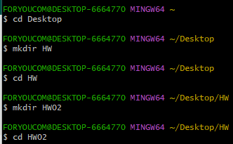
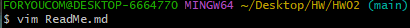

# 프로그래밍 패턴 2주차 GIT에 대한 조사

## 1.VCS란 무엇인가? 
 vcs란 Version Control System(버전 관리 시스템)으로 형성 관리 지침을 활용하여 다양한 버전의 소프트웨어나 콘텐츠의 개발, 변경, 개선과 관련된 수정사항을 관리하고 추적하는 도구로 동일한 소스코드에 대한 여려 버전을 관리하는 것을 말합니다. 즉 파일 변경 사항을 시간에 따라 기록하며 필요할 때 특정 버전을 다시 호출할 수 있는 시스템입니다. 버전 관리의 종류로는 로컬, 중앙집중식, 분산이 있으며 git은 이 중에 **분산vcs(DVCS)**에 속합니다.

## 2.DVCS와 VCS의 차이점
 우선 DVCS란 로컬 저장소(참여자의 각 컴퓨터)에 프로젝트파일을 1차적으로 저장하고 사용자의 명령에 따라 원격 저장소(서버저장소)에도 저장이 가능합니다. 
 - 네트워크 의존성 
    * VCS는 중앙서버에 의존하여야 하기 때문에 네트워크 연결이 필수입니다.
    * DVCS는 로컬 저장소에 전체 저장소에 사본을 가지고 있어 네트워크 연결이 없더라도 작업이 가능합니다.
 - 분산의 유연성
    * VCS는 중앙 서버에서 파일을 저장하고 가져와야 하기 때문에 중앙 서버에 문제가 발생하면 작업에 영향이 갈 수 있읍니다
    * DVCS는 각 개발자가 로컬에서 작업하고 있어 변경사항을 다른 개발자와 공유하기 때문에 중앙 서버의 문제가 전체 작업에 직접적으로 영향을 미치지 않습니다.
 - 협업과 분산 개발
    * VCS의 경우 네트워크 문제, 병합지연(중앙서버에서만 파일을 업데이트 할 수 있어서 여러 개발자가 동시에 파일을 수정하고 중앙 서버에 푸시하려하면 충돌이 발생할 수 있습니다.), 중앙 서버의 관리(중앙 서버에서 모든 변경 사항을 관리하고 이력을 유지해야 하므로 관리자의 실수나 잘못된 구성으로 충돌이 발생할 수 있습니다.)로 인하여 서버에서의 충돌이 자주 발생할 수 있습니다.
    * DVCS는 여러 사용자가 동시에 작업하며 변경 사항을 쉽게 병합할 수 있도록 지원합니다

이런한 VCS의 문제점으로 인하여 현재는 DVCS가 대부분의 프로젝트에서 선호되는 방식으로 git같은 DVCS가방식이많은 프로젝트에서 널리 사용되고 있습니다.

## 3. GIT을 이용하여 remote repository를 생성하고 git용 bash로 새로 initialize한 local repository랑 연결하는 과정을 스크린샷과 함께 각 명령어의 자세한 설명을 작성하시오. (이때 브랜치명은 main으로 합니다.)

1. 처음 시작하는 위치 '~' 는 사용자폴더라는 뜻이기 때문에 cd명령어를 사용하여 폴더를HW02폴더까지 이동시킵니다. 이동 시키는 중에 HW02폴더가 없기 때문에 mkdir 폴더명을 사용하여 폴더를 생성합니다.

2. cd를 사용하여 HW02폴더로 지정 되었다면 git init을 사용하여 git을 초기화하여 새로운 로컬 저장소를 만들어 줍니다. (이때 정상적으로 깃이 초기화되어 새로운 로컬 저장소가 생겼다면 초기화했던 폴더의 .git이라는 숨겨진 폴더가 생깁니다.)

3. git branch -m 현재이름 바꿀이름 을 사용하여 브랜치명을 master에서 main으로 변경해줍니다.

4. git congig --global user.name/email을사용하여 깃허브 닉네임과 이메일을 등록합니다. (등록과정은 한 컴퓨터에서 1회만 하면 됩니다.) 이 설정은 커밋을 할 때 커밋 기록에 사용됩니다.

5. vim 파일명을 사용하여 vim편집기를 실행하여 파일을 생성합니다.

git remote add origin 원격 저장소URL 을사용하여 git에서 로컬 저장소를 원격 저장소에 추가하는 명령입니다. (origin은 관례적으로 보통 원격 저장소의 기본 이름으로 사용됩니다.)

git add . 은 git에서 변경된 모든 파일을 스테이징 영역에 추가하는 명령입니다. 여기서 '.'은 현재 디렉토리를 나타내며 변경된 모든 파일을 의미합니다.

